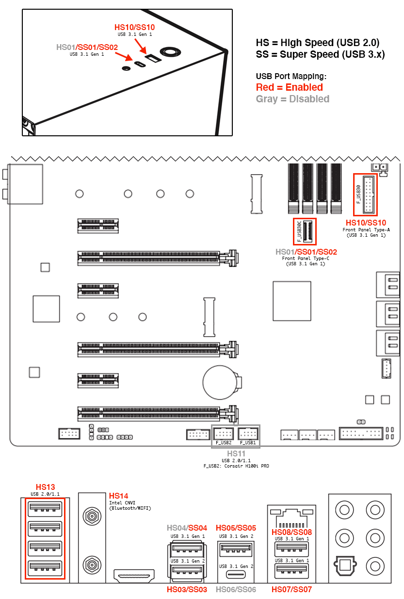

# Hackintosh v3

Installation guide for my Hackintosh v3 build dual-booting macOS Big Sur and Windows 10. This build is based on [Dortania's OpenCore Install Guide](https://dortania.github.io/OpenCore-Install-Guide/). The previous version of this guide using the Clover bootloader can be found [here](). The version numbers reported in this guide were the releases available at the time of installation and more than likely can be replaced with the latest iteration.

* [EFI](EFI/): Copy of current EFI directory from macOS boot drive
* [EFI_install](EFI_install/): Copy of EFI directory from the USB drive used during installation

## Installation

### USB Creation

Follow the OpenCore Install Guide to [create the macOS installer](https://dortania.github.io/OpenCore-Install-Guide/installer-guide/mac-install.html), [prepare the base OpenCore system](https://dortania.github.io/OpenCore-Install-Guide/installer-guide/opencore-efi.html), and [gather the necessary files to boot macOS](https://dortania.github.io/OpenCore-Install-Guide/ktext.html). The drivers, kexts, and SSDTs I used are as follows:

* Drivers
  * [HfsPlus.efi](https://github.com/acidanthera/OcBinaryData/blob/master/Drivers/HfsPlus.efi)
  * OpenRuntime.efi (Included with OpenCore)
* Kexts
  * [AppleALC.kext](https://github.com/acidanthera/AppleALC/releases) (v1.5.8)
  * [IntelMausi.kext](https://github.com/acidanthera/IntelMausi/releases) (v1.0.5)
  * [Lilu.kext](https://github.com/acidanthera/Lilu/releases) (v1.5.1)
  * [USBInjectAll.kext](https://bitbucket.org/RehabMan/os-x-usb-inject-all/downloads/) (v0.7.1)
  * [VirtualSMC.kext](https://github.com/acidanthera/VirtualSMC/releases) (v1.2.1)
    * SMCProcessor.kext
    * SMCSuperIO.kext
  * [WhateverGreen.kext](https://github.com/acidanthera/WhateverGreen/releases) (v1.4.8)
* SSDTs (Prebuilt for Intel Desktop Coffee Lake)
  * [SSDT-PLUG-DRTNIA](https://github.com/dortania/Getting-Started-With-ACPI/blob/master/extra-files/compiled/SSDT-PLUG-DRTNIA.aml)
  * [SSDT-EC-USBX-DESKTOP](https://github.com/dortania/Getting-Started-With-ACPI/blob/master/extra-files/compiled/SSDT-EC-USBX-DESKTOP.aml)
  * [SSDT-AWAC](https://github.com/dortania/Getting-Started-With-ACPI/blob/master/extra-files/compiled/SSDT-AWAC.aml)
  * [SSDT-PMC](https://github.com/dortania/Getting-Started-With-ACPI/blob/master/extra-files/compiled/SSDT-PMC.aml)

### OpenCore Configuration

Follow the OpenCore Install Guide to [setup the initial config.plist file](https://dortania.github.io/OpenCore-Install-Guide/config.plist/) and [configure for Intel Desktop Coffee Lake](https://dortania.github.io/OpenCore-Install-Guide/config.plist/coffee-lake.html).

* To enable the iGPU (UHD 630) for headless compute tasks, set `AAPL,ig-platform-id=0300913E` and exclude the `framebuffer-patch-enable` and `framebuffer-stolenmem` properties under `DeviceProperties`.
* If you already know the MAC address of your ethernet adapter, enter it under `PlatformInfo > Generic > ROM`. If you don't, this can be updated during post installation using System Preferences > Network > Ethernet > Advanced > Hardware > MAC Address to identify the correct value.

A sanitized version of my USB drive config file can be found [here](EFI_install/OC/config.plist).

### BIOS Settings (Version F12k)

Enter **Advanced Mode** and **Load Optimized Defaults** to reset the default BIOS settings. Modify the following settings (may vary depending on motherboard model and BIOS version):

* Tweaker
  * Advanced CPU Settings
    * Vt-d → **Disabled**
* Settings
  * IO Ports
    * Initial Display Output → **PCIe 1 Slot**
    * Internal Graphics → **Enabled**
    * DVMT Pre-Allocated → **64MB**
    * Above 4G Decoding → **Enabled**
    * USB Configuration
      * XHCI Hand-off → **Enabled**
    * SATA and RST Configuration
      * SATA Mode Selection → **ACHI**
  * Miscellaneous
    * Intel Platform Trust Technology (PTT) → **Disabled**
    * Software Guard Extensions (SGX) → **Disabled**
  * Smart Fan 5
    * CPU_FAN (or whichever header was used for the AIO CPU cooler)
      * Speed Control → **Full Speed**
* Boot
  * CFG Lock → **Disabled**
  * Fast Boot → **Disabled**
  * Windows 8/10 Features → **Windows 8/10**
  * CSM Support → **Disabled**
  * Secure Boot
    * Secure Boot Enable → **Disabled**

Select **Save and Exit** to save the new BIOS settings and reboot

### Install macOS

1. Restart computer and set the USB drive as the default BIOS boot device
2. Select the `Install macOS Big Sur (external)` option from the OpenCore Boot Menu
3. Launch Disk Utility and format the destination drive (Samsung 970 Evo)
    * Name: `Macintosh SSD`
    * Format: `APFS`
    * Scheme: `GUID Partition Map`
4. Launch Install macOS and select the `Macintosh SSD` drive as the destination
    * As the system restarts, keep selecting `macOS Installer` from the OpenCore Boot Menu
5. Once the installation is complete, select `Macintosh SSD` from the OpenCore Boot Menu and proceed through the normal macOS setup

## Post Installation

Based heavily on [Dortania's OpenCore Post-Install Guide](https://dortania.github.io/OpenCore-Post-Install/).

### Make macOS Drive Bootable

1. Mount the EFI partition of `Macintosh SSD` and copy over the entire EFI directory from the USB drive
2. Restart the computer and select the internal drive (Samsung 970 Evo) as the default BIOS boot device
3. Select `Macintosh SSD` from the OpenCore Boot Menu
4. You should now have a bootable macOS installation!

_Note: You can now remove the USB drive but keep it handy for debugging issues with your Hackintosh._

### Enable FileVault

[FileVault](https://support.apple.com/en-us/HT204837) is used to encrypt the startup disk on your Hackintosh. Enabling it is entirely optional, but probably a good idea for the security conscious. Before turning on the feature, you will need to make sure that OpenCore is properly configured to interact with the encrypted drive. Follow the OpenCore Post-Install Guide to [prepare your config.plist file for use with FileVault](https://dortania.github.io/OpenCore-Post-Install/universal/security/filevault.html).

The following changes were necessary:

* Misc
  * Boot
    * PollAppleHotKeys → **True**
  * Security
    * AuthRestart → **True**

You can now enable FileVault under System Preferences > Security & Privacy > FileVault like on a real Mac. Once the encryption process is complete, your account password will be required to decrypt the startup disk every time your Hackintosh starts up.

_Note: You should also make these changes to your USB drive OpenCore configuration so that it can properly boot your system if the `Macintosh SSD` EFI partition gets messed up. If you don't update the configuration, then the OpenCore bootloader may not be able to properly handle the FileVault-encrypted drive._

## Map USB Ports

Follow the OpenCore Post-Install Guide to [map USB on your system](https://dortania.github.io/OpenCore-Post-Install/usb/#macos-and-the-15-port-limit). The complete USB port layout for the Gigabyte Z390 AORUS PRO WIFI motherboard is detailed in the image below with the ports I enabled indicated in red. If you have the same motherboard and want to use this _exact_ USB port mapping, you can download my [`USBMap.kext`](EFI/OC/Kexts/USBMap.kext).

* No ACPI patches were necessary to rename mappings
* Disabling the internal USB 2.0 headers can prevent sleep issues caused by the AIO
* If you don't need Bluetooth, you can disable `HS14` and enable one of the disabled ports
* You can disable the `XhciPortLimit` quirk in your OpenCore configuration once complete

